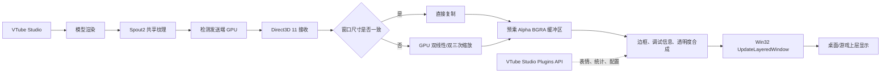

# VTSFloat_Meow

VTSFloat_Meow 是一个面向 Windows 的 VTube Studio 透明模型悬浮层。当前版本：**Beta 1.0.1**。

## 1. 这个工具解决什么问题

许多 VTuber 用户希望把 VTube Studio 模型放到游戏、桌面或其他应用上方。传统做法通常要借助 OBS、Bandicam 等工具完成采集、抠图、透明图层和窗口叠加，配置复杂，也会引入额外的编码、合成和显示开销。

VTSFloat_Meow 专门处理这层工作：VTube Studio 负责渲染模型并通过 Spout2 发送共享纹理，本程序负责接收、缩放、合成透明画面并显示。它不向游戏、应用或系统底层注入代码，也不依赖 OBS、Bandicam 或 Python。

## 2. 主要功能

- 任意调整模型窗口大小，并支持比例锁定或自由拉伸。
- 主屏居中、多显示器切换、恢复上次窗口位置和大小。
- 支持全屏游戏、无边框窗口和普通桌面应用上层显示。
- 锁定后鼠标可穿透模型，与下方应用继续交互。
- 可设置鼠标经过模型时的不透明度和触发范围，并支持平滑过渡。
- 可在悬停时触发表情，离开或超时后恢复原来的表情状态。
- 自定义边框颜色、渐变模式、粗细、调试信息和帧率策略。
- 自动匹配 VTube Studio 的 Spout GPU，并提供多 GPU 选择和 VTube Studio 启动辅助。
- 系统托盘、快捷键、VTube Studio Plugins API 连接和设置缓存。

## 3. 工作原理



数据管线可以简单理解为：

```text
VTube Studio 渲染模型
        ↓
Spout2 共享纹理（发送端 GPU）
        ↓
VTSFloat_Meow 在同一 GPU 上接收
        ↓
必要时缩放并转换为预乘 Alpha BGRA
        ↓
叠加边框、透明度和调试层
        ↓
原生 Win32 分层窗口显示
```

程序不注入任何游戏或应用，不读取游戏画面，也不参与游戏渲染管线。

## 4. 使用须知

### 基本使用

1. 启动 VTube Studio。
2. 在 VTube Studio 的“设置 → 相机”中启用 **Spout2/透明推流**，背景选择 `ColorPicker`。
3. 启动根目录的 `VTSFloat_Meow.exe`，或运行：

   ```powershell
   .\start_overlay.cmd
   ```

4. 首次连接 VTube Studio Plugins API 时，在 VTS 中允许插件访问。
5. 点击“完成”锁定覆盖层；默认快捷键为 `Ctrl+Shift+L`。

### 为什么推荐核显/节能 GPU

Spout2 共享纹理通常只能在发送端所在的 GPU 上直接打开。VTube Studio、Spout2 和 VTSFloat_Meow 最好运行在同一块 GPU 上。推荐使用核显或节能 GPU，是因为高性能独显通常还要承担游戏或高负载应用的渲染任务。

当游戏以无上限帧率运行时，独显的渲染队列、显存带宽和线程调度可能已经接近满载。此时再让 VTube Studio 和覆盖层争用同一块 GPU，可能导致 Spout 互斥等待、帧率下降，严重时表现为视频、游戏或覆盖层短暂卡死。使用核显可以把模型链路与游戏渲染分开。

只有一块 GPU 的电脑也可以使用；程序会直接使用这块 GPU。多 GPU 电脑切换 GPU 后，需要按提示重启 VTube Studio 和覆盖层。

### INI 缓存

设置保存在：

```text
%LOCALAPPDATA%\vts_overlay_layered.ini
```

其中包括窗口位置和大小、比例锁定、帧率、边框、快捷键、GPU 选择及 VTube Studio API 端口。删除该文件，或在“调试 → 清除缓存并重置脚本”中操作，可恢复默认设置。文件只保存本机配置，不是项目源码的一部分。

## 5. 性能与性能设计

### 分辨率匹配

建议 VTube Studio 画布分辨率与 VTSFloat_Meow 窗口分辨率尽量接近。两者分辨率越大，接收、缩放、显存读写和分层窗口合成的成本越高。

- **VTS 分辨率大于覆盖层窗口**：建议先把 VTS 画布缩小到接近覆盖层大小。这样画质通常已经足够，除非使用 4K 或更高分辨率屏幕，否则更高源分辨率往往只是额外消耗性能。
- **VTS 分辨率小于覆盖层窗口**：覆盖层需要放大画面，整体性能压力通常更低，但细节会受源分辨率限制。程序提供 GPU 双线性和双三次采样，平衡模式可以减少放大后的锋利锯齿。

### 调试信息怎么判定

调试模式中的 `FPS` 是覆盖层实际完成并上屏的帧率；`目标` 是覆盖层请求的刷新率；`VTS配置` 来自 VTube Studio 配置文件；`VTS实时` 来自 VTube Studio API 统计。`接收/缩放/上屏` 分别是 Spout 接收、缩放转换和 `UpdateLayeredWindow` 的平均耗时。

调试栏中的“对齐”不是简单比较两个 FPS，而是比较 VTS 源画布和覆盖层窗口的像素面积：

```text
对齐率 = min(VTS像素数, 覆盖层像素数) / max(VTS像素数, 覆盖层像素数) × 100%
```

### 帧率设置

优先选择“跟随 VTS 配置（推荐）”或使用不高于 VTS 实际输出的固定帧率。覆盖层设置得比 VTS 更高不会产生更多模型帧，只会重复接收、缩放和上屏，形成无用功，并可能增加 GPU 调度压力。VSYNC、VSYNC_HALF 等模式也会限制发送端更新频率。

## 6. 技术栈

- C++17
- Win32 窗口、输入、系统托盘和快捷键 API
- Direct3D 11 / DXGI
- Spout2 DirectX 共享纹理
- `UpdateLayeredWindow` 分层透明窗口
- VTube Studio Plugins API（WebSocket）
- CMake + Visual Studio 2022 MSVC

## 7. 早期瓶颈与解决方向

项目早期经历过几次失败路线：

1. **Python/Qt 主线程渲染**：接收、缩放、绘制和窗口消息挤在同一条 GUI 线程，高帧率游戏前台运行时容易排队，拖拽和模型画面会一起卡顿。
2. **DXGI SwapChain/Present 路线**：在无上限帧率游戏中，交换链提交可能被桌面合成器或显卡调度阻塞数秒，出现“FPS 计数器停止、视频也卡住”的现象。
3. **跨 GPU 共享纹理**：VTube Studio 和覆盖层不在同一 GPU 时，共享句柄无法稳定打开，接收端只能拿到空纹理或长时间等待。

当前实现改为独立的原生 C++ 渲染线程、Direct3D 11 接收、预乘 Alpha DIB 和 `UpdateLayeredWindow`。同时关闭会造成长时间等待的 Spout 可选帧同步互斥锁，由覆盖层自己的刷新调度控制节奏，避免游戏高负载时把等待传递到整个桌面。

## 8. 使用前提

- Windows 10/11，建议使用支持 Direct3D 11 的硬件 GPU。
- 已安装并正常运行 VTube Studio。
- VTube Studio 已开启 Spout2 透明推流，发送端名称为 `VTubeStudioSpout`。
- VTube Studio、Spout2 发送端与 VTSFloat_Meow 尽量使用同一块 GPU。
- 若使用表情悬停功能，需要在 VTube Studio 中授权 VTSFloat_Meow Plugins API。

## 构建

安装 Visual Studio 2022 C++ 工具链后，在项目根目录执行：

```powershell
.\native\build_native.ps1 -Configuration Release
```

输出为根目录的 `VTSFloat_Meow.exe`。Spout2 接收端已编译进程序，用户不需要另行安装 Spout2。

## 目录说明

```text
VTSFloat_Meow.exe           可直接运行的程序
native/                     C++ 源码、CMake 配置和编译脚本
native/third_party/Spout2   内置 Spout2 源码
start_overlay.cmd           启动程序的便捷脚本
stop_overlay.cmd            关闭程序的便捷脚本
md/                         面向开发者的补充说明
```

## 许可证与发布状态

当前为 **Beta 1.0.1**，主要用于测试透明模型接收、GPU 匹配和高负载游戏场景下的稳定性。正式版前仍可能调整界面和配置格式。
